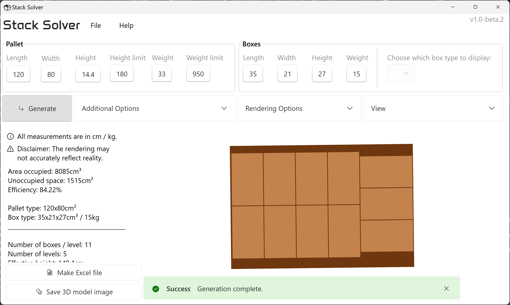

# Stack Solver

Stack Solver is a powerful and intuitive application designed to optimize the process of loading cargo. This app provides an efficient solution for logistics and warehouse management by determining the most effective way to load boxes of various sizes onto pallets.

> [!IMPORTANT]  
> A major rewrite is ongoing and should be finished around March if everything goes well. The new version will have additional features such as mixed-SKU pallets, improved algorithms and additional stacking parameters that are considered (e.g, fragile boxes, center of weight, etc.), along a completely new multi-page UI. The (very experimental and unfinished) code is available under the `overhaul` branch. Once completed, I will also aim to make the app available on Microsoft Store for easier installation and updating.

## Features

- Pallet Optimization: Calculates the optimal arrangement of boxes on a pallet to maximize space utilization and stability.
- Interactive 3D Visualization: Provides a visual representation of the pallet setup.
- User-friendly Interface: Intuitive and modern design that makes it easy for users to input data, adjust parameters, and view results.
- Export and Share: Generate detailed reports and visual guides that can be easily shared with team members.

## Screenshots




## Installation 

Install the app by running ```setup.exe``` contained in the zip archive in the releases page.

If you want to contribute to this project, just clone this repository or download the source code.

## Documentation

Coming soon™

## Roadmap

- Truck loading optimization
- Multiple box types on same pallet
- also see the message above

## Authors

- [@VladM7](https://github.com/VladM7)

## Acknowledgements

This project would not have been possible without the following frameworks and libraries:
- [WPF UI](https://github.com/lepoco/wpfui)
