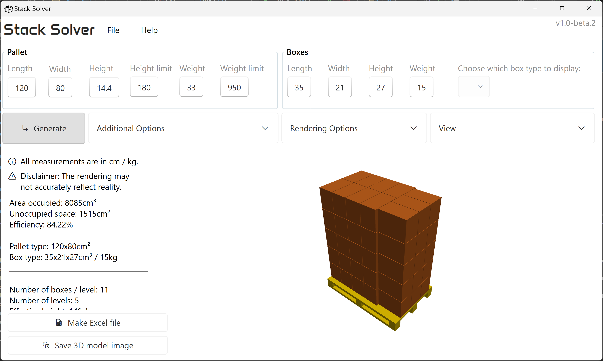

# Stack Solver

Stack Solver is a powerful and intuitive application designed to optimize the process of loading cargo. This app provides an efficient solution for logistics and warehouse management by determining the most effective way to load boxes of various sizes onto pallets and then efficiently load these pallets into a truck.

## Features

- Pallet Optimization: Calculates the optimal arrangement of boxes on a pallet to maximize space utilization and stability.
- Truck Loading Efficiency: Determines the best way to load pallets into a truck, ensuring balanced weight distribution and optimal space usage.
- Interactive 3D Visualization: Provides a visual representation of the pallet and truck loading process.
- User-friendly Interface: Intuitive and modern design that makes it easy for users to input data, adjust parameters, and view results.
- Export and Share: Generate detailed reports and visual guides that can be easily shared with team members.

## Installation 

Install the app by running ```setup.exe``` contained in the zip archive in the releases page.

If you want to contribute to this project, just clone this repository or download the source code.

## Documentation

Coming soon™

## Screenshots



## Roadmap

- More truck loading optimization options
- Multiple box types on same pallet

## Authors

- [@VladM7](https://github.com/VladM7)

## Acknowledgements

This project would not have been possible without the following frameworks and libraries:
- [WPF UI](https://github.com/lepoco/wpfui)